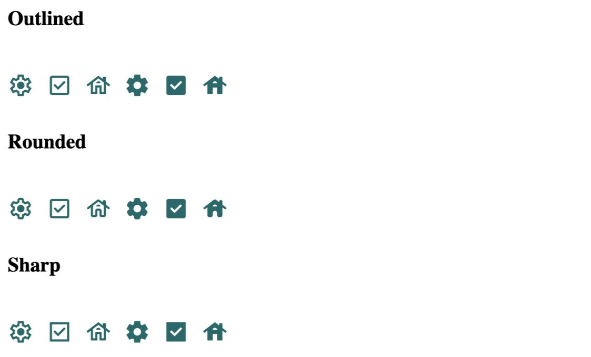
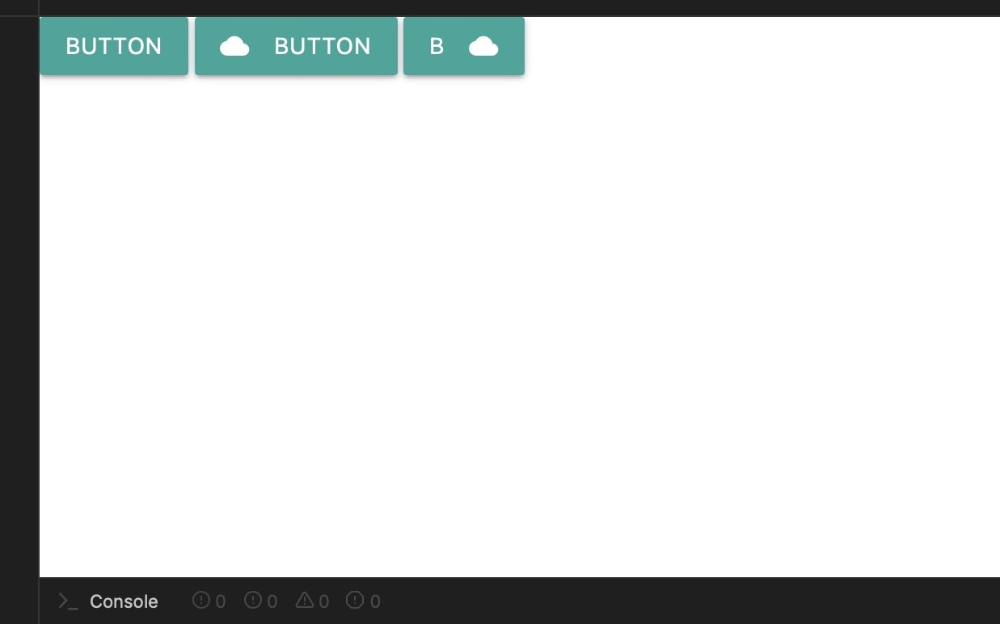
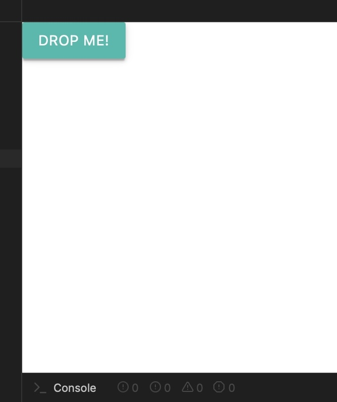
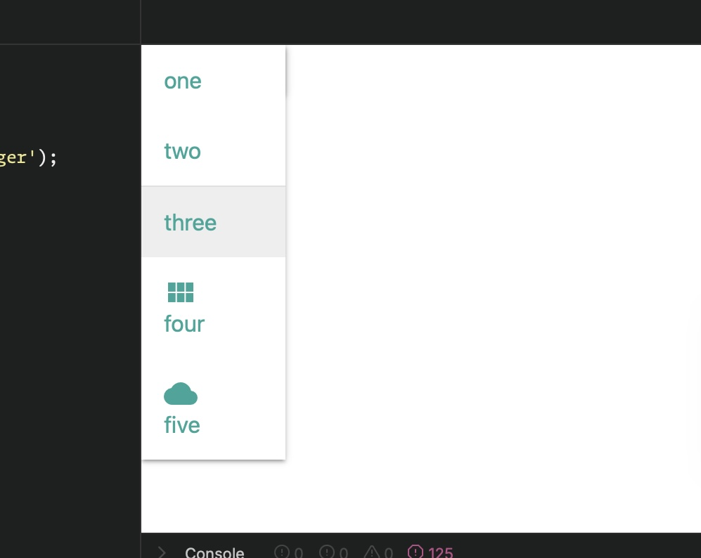

# Before Starting with the Tutorial:

# Part 1: Color Template:

# Part 2: Using Icon Buttons with GitHub

In this section, we will explore how to implement icon buttons using Material Design's [Icon Buttons](https://m3.material.io/components/icon-buttons/overview). We will use the Material Symbols font for our icons. 

You can find the necessary codes that we will use in the next steps here: https://github.com/material-components/material-web/blob/main/docs/components/icon-button.md

## Step 1: Add Links in HTML 
Add the following links (Icon Shapes) to your HTML file:

```html
<link href="https://fonts.googleapis.com/css2?family=Material+Symbols+Outlined:opsz,wght,FILL@20..48,100..700,0..1" rel="stylesheet">
<link href="https://fonts.googleapis.com/css2?family=Material+Symbols+Rounded:opsz,wght,FILL@20..48,100..700,0..1" rel="stylesheet">
<link href="https://fonts.googleapis.com/css2?family=Material+Symbols+Sharp:opsz,wght,FILL@20..48,100..700,0..1" rel="stylesheet">
```

## Step 2: Add HTML Code

Now, let's add the following HTML code for the icons:

```html
<h3>Outlined</h3>
<span>
  <span class="material-symbols-outlined">settings</span>
  <span class="material-symbols-outlined">check_box</span>
  <span class="material-symbols-outlined">house</span>
  <span class="material-symbols-outlined filled">settings</span>
  <span class="material-symbols-outlined filled">check_box</span>
  <span class="material-symbols-outlined filled">house</span>
</span>

<h3>Rounded</h3>
<span>
  <span class="material-symbols-rounded">settings</span>
  <span class="material-symbols-rounded">check_box</span>
  <span class="material-symbols-rounded">house</span>
  <span class="material-symbols-rounded filled">settings</span>
  <span class="material-symbols-rounded filled">check_box</span>
  <span class="material-symbols-rounded filled">house</span>
</span>

<h3>Sharp</h3>
<span>
  <span class="material-symbols-sharp">settings</span>
  <span class="material-symbols-sharp">check_box</span>
  <span class="material-symbols-sharp">house</span>
  <span class="material-symbols-sharp filled">settings</span>
  <span class="material-symbols-sharp filled">check_box</span>
  <span class="material-symbols-sharp filled">house</span>
</span>
```

## Step 3: Add CSS Code
```css
span {
  color: #006A6A;
  --md-icon-size: 48px;
  font-size: var(--md-icon-size);
  vertical-align: middle; /* Align icons with text if any */
}
.rounded {
  font-family: 'Material Symbols Rounded';
}
.sharp {
  font-family: 'Material Symbols Sharp';
}
.filled {
  font-variation-settings: 'FILL' 1; /* Apply fill effect */
}
```

## Step 4: Run Your Code

After clicking on Run, you should be able to see your icons displayed. Your result should look similar to this:



# Part 3: Use Buttons with Front-End Framework Based on Material Design

## Step 1: Download CSS File
Download the CSS file from [Materialize CSS Getting Started](https://materializecss.com/getting-started.html).

## Step 1: Add Links in HTML
Add the following links (CSS & Icons) to your HTML file:

```html
<link rel="stylesheet" href="https://cdnjs.cloudflare.com/ajax/libs/materialize/1.0.0/css/materialize.min.css">
<link href="https://fonts.googleapis.com/icon?family=Material+Icons" rel="stylesheet">
```

## Step 3: Go to Components and Then Buttons

Visit the Materialize [CSS Buttons page](https://materializecss.com/buttons.html).

## Step 4: Copy and Paste This Code to Your HTML

Your current HTML should look like this:

```html
<link rel="stylesheet" href="https://cdnjs.cloudflare.com/ajax/libs/materialize/1.0.0/css/materialize.min.css">
<link href="https://fonts.googleapis.com/icon?family=Material+Icons" rel="stylesheet">

<a class="waves-effect waves-light btn">button</a>
<a class="waves-effect waves-light btn"><i class="material-icons left">cloud</i>button</a>
<a class="waves-effect waves-light btn"><i class="material-icons right">cloud</i>b
```

## Step 5: Run Your Code

After clicking on Run, you should be able to see your icons displayed. Your result should look similar to this:



# Part 4: Using Dropdown with Front-End Framework Based on Material Design

## Step 1: Include Required Links
To use Materialize CSS, JS and Material Icons, include the following links in your HTML:

```html
<!-- Materialize CSS -->
<link rel="stylesheet" href="https://cdnjs.cloudflare.com/ajax/libs/materialize/1.0.0/css/materialize.min.css">
<!-- Material Icons -->
<link href="https://fonts.googleapis.com/icon?family=Material+Icons" rel="stylesheet">
<!-- Materialize JavaScript -->
<script src="https://cdnjs.cloudflare.com/ajax/libs/materialize/1.0.0/js/materialize.min.js"></script>
```
Step 2: Add the Dropdown HTML

Next, copy and paste the following HTML code into the body of your HTML file. This code creates a dropdown trigger button and its content:

```html
<!-- Dropdown Trigger -->
<a class='dropdown-trigger btn' href='#' data-target='dropdown1'>Drop Me!</a>

<!-- Dropdown Structure -->
<ul id='dropdown1' class='dropdown-content'>
    <li><a href="#!">one</a></li>
    <li><a href="#!">two</a></li>
    <li class="divider" tabindex="-1"></li>
    <li><a href="#!">three</a></li>
    <li><a href="#!"><i class="material-icons">view_module</i>four</a></li>
    <li><a href="#!"><i class="material-icons">cloud</i>five</a></li>
</ul>
```
## Step 4: Add JavaScript Initialization

Copy and paste the following JavaScript code into the javascript location:

```javascript
document.addEventListener('DOMContentLoaded', function() {
    var elems = document.querySelectorAll('.dropdown-trigger');
    var instances = M.Dropdown.init(elems);
});
```

## Step 5: Run Your Code

After clicking on Run, you should be able to see your icons displayed. Your result should look similar to this:




# Part 5: Material Design Kit in Figma
