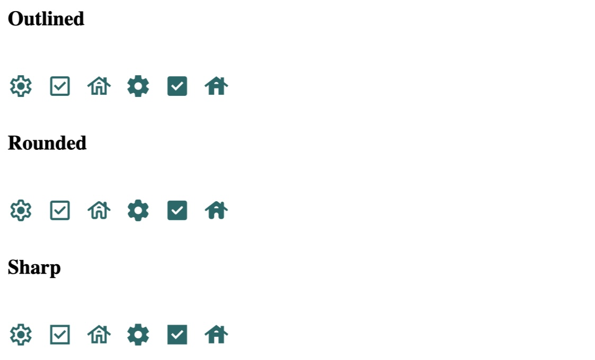

# Introduction to Material Design

In this tutorial, you will learn how to integrate **Material Design** into your web development projects. We'll walk you through:

- How to use different Material Design components
- Where to find useful code snippets
- How to integrate these components into your projects

# Before Starting with the Tutorial:

### Step 1: 
Use any source code editor or an online editor that supports HTML, CSS, and JavaScript. I will be using JSFiddle in this tutorial. It would be best if you create an account to be able to add external resources and save your files.

### Step 2:
Make sure to read through [Material.io](https://material.io). It contains interesting facts and different components you can explore.

### Step 3: 
It would be helpful to have a Figma account for **Part 5** to access the Material Design kit.

# Part 1: Creating a Color Scheme and Selecting Fonts Using Material Design

Follow these steps to create a custom color scheme and select a font type using the Material Design Theme Builder:

### Step 1: 
Open the [Material Theme Builder](https://material-foundation.github.io/material-theme-builder/) website.

### Step 2: 
Collect your **Core Colors**:
- Start by selecting your **Primary**, **Secondary**, and **Tertiary** colors. You can either:
  - Choose from the color palette, or
  - Input specific color codes to match your desired colors.
- Ensure that you adjust the following:
  - **Error**: Color for error states.
  - **Neutral**: Used for background and surfaces.
  - **Neutral Variant**: Applied for medium emphasis and variants.
  
### Step 3: 
Once you're satisfied with the core colors, click the **Next** button.  
This will take you to the typography customization section.

### Step 4: 
Select a **Font Type** for your theme:
- In the typography section, pick a font from the available options.
- Customize the font to match the style and tone of your project.

### Step 5: 
Preview your color scheme and typography:  
The Theme Builder will display a preview of how your selected colors and fonts will look across various UI components.

### Step 6: 
Click the **Export** button:
- Choose the **CSS** option to generate a CSS file containing the variables for both your color scheme and typography.

### Step 7: Integrate Colors and Fonts into Your Project

In this step, we will integrate the colors and fonts from the Material Theme Builder into our project. You can either download the CSS file or copy the color variables directly.

#### 1. Include the CSS

- If you downloaded the CSS file, ensure it is included in your project.
- If you copied the variables, paste them into your existing stylesheet to apply the custom theme across your components.

#### 2. HTML Structure

Use the following HTML to apply the `dark-medium-contrast` class and see the theme in action:

```html
<body class="dark-medium-contrast">
    <div class="card">
        This is a card with a dark medium contrast theme.
    </div>
    <p class="error-message">This is an error message</p>
</body>
```

#### 3. CSS Integration

Paste the theme color variables you copied from the Material Theme Builder into your CSS file. Here’s how you can structure your CSS:

```css
.dark-medium-contrast {
    --md-sys-color-primary: rgb(255 182 214);
    --md-sys-color-surface: rgb(25 17 20);
    --md-sys-color-on-surface: rgb(255 249 249);
    --md-sys-color-error: rgb(255 186 177);
    /* Additional color variables */
    --md-sys-color-surface-tint: rgb(254 176 211);
    --md-sys-color-on-primary: rgb(49 2 31);
    --md-sys-color-background: rgb(25 17 20);
    --md-sys-color-on-background: rgb(238 223 227);
}

.card {
    background-color: var(--md-sys-color-primary);
    color: var(--md-sys-color-on-surface);
    padding: 20px;
    border-radius: 8px;
    box-shadow: 0 2px 5px rgba(0, 0, 0, 0.2);
}
```

#### 4. Example Result

After implementing the above code, you should see a card with a dark background and contrasting text colors.

The result will look something like this:


# Part 2: Using Icon Buttons with GitHub

In this section, we will explore how to implement icon buttons using Material Design's [Icon Buttons](https://m3.material.io/components/icon-buttons/overview). We will use the Material Symbols font for our icons. 

You can find the necessary codes that we will use in the next steps here: https://github.com/material-components/material-web/blob/main/docs/components/icon-button.md

### Step 1: Add Links in HTML 
Add the following links (Icon Shapes) to your HTML file:

```html
<link href="https://fonts.googleapis.com/css2?family=Material+Symbols+Outlined:opsz,wght,FILL@20..48,100..700,0..1" rel="stylesheet">
<link href="https://fonts.googleapis.com/css2?family=Material+Symbols+Rounded:opsz,wght,FILL@20..48,100..700,0..1" rel="stylesheet">
<link href="https://fonts.googleapis.com/css2?family=Material+Symbols+Sharp:opsz,wght,FILL@20..48,100..700,0..1" rel="stylesheet">
```

### Step 2: Add HTML Code

Now, let's add the following HTML code for the icons:

```html
<h3>Outlined</h3>
<span>
  <span class="material-symbols-outlined">settings</span>
  <span class="material-symbols-outlined">check_box</span>
  <span class="material-symbols-outlined">house</span>
  <span class="material-symbols-outlined filled">settings</span>
  <span class="material-symbols-outlined filled">check_box</span>
  <span class="material-symbols-outlined filled">house</span>
</span>

<h3>Rounded</h3>
<span>
  <span class="material-symbols-rounded">settings</span>
  <span class="material-symbols-rounded">check_box</span>
  <span class="material-symbols-rounded">house</span>
  <span class="material-symbols-rounded filled">settings</span>
  <span class="material-symbols-rounded filled">check_box</span>
  <span class="material-symbols-rounded filled">house</span>
</span>

<h3>Sharp</h3>
<span>
  <span class="material-symbols-sharp">settings</span>
  <span class="material-symbols-sharp">check_box</span>
  <span class="material-symbols-sharp">house</span>
  <span class="material-symbols-sharp filled">settings</span>
  <span class="material-symbols-sharp filled">check_box</span>
  <span class="material-symbols-sharp filled">house</span>
</span>
```

### Step 3: Add CSS Code
```css
span {
  color: #006A6A;
  --md-icon-size: 48px;
  font-size: var(--md-icon-size);
  vertical-align: middle; /* Align icons with text if any */
}
.rounded {
  font-family: 'Material Symbols Rounded';
}
.sharp {
  font-family: 'Material Symbols Sharp';
}
.filled {
  font-variation-settings: 'FILL' 1; /* Apply fill effect */
}
```

### Step 4: Run Your Code

After clicking on Run, you should be able to see your icons displayed. Your result should look similar to this:



# Part 3: Use Buttons with Front-End Framework Based on Material Design

### Step 1: Download CSS File
Download the CSS file from [Materialize CSS Getting Started](https://materializecss.com/getting-started.html).

### Step 2: Add Links in HTML
Add the following links (CSS & Icons) to your HTML file:

```html
<link rel="stylesheet" href="https://cdnjs.cloudflare.com/ajax/libs/materialize/1.0.0/css/materialize.min.css">
<link href="https://fonts.googleapis.com/icon?family=Material+Icons" rel="stylesheet">
```

### Step 3: Go to Components and Then Buttons

Visit the Materialize [CSS Buttons page](https://materializecss.com/buttons.html).

### Step 4: Copy and Paste This Code to Your HTML

Your current HTML should look like this:

```html
<link rel="stylesheet" href="https://cdnjs.cloudflare.com/ajax/libs/materialize/1.0.0/css/materialize.min.css">
<link href="https://fonts.googleapis.com/icon?family=Material+Icons" rel="stylesheet">

<a class="waves-effect waves-light btn">button</a>
<a class="waves-effect waves-light btn"><i class="material-icons left">cloud</i>button</a>
<a class="waves-effect waves-light btn"><i class="material-icons right">cloud</i>b
```

### Step 5: Run Your Code

After clicking on Run, you should be able to see your icons displayed. Your result should look similar to this:


# Part 4: Using Dropdown with Front-End Framework Based on Material Design
[Materialize CSS](https://materializecss.com/getting-started.html)

### Step 1: Include Required Links
To use Materialize CSS, JS and Material Icons, include the following links in your HTML:

```html
<!-- Materialize CSS -->
<link rel="stylesheet" href="https://cdnjs.cloudflare.com/ajax/libs/materialize/1.0.0/css/materialize.min.css">
<!-- Material Icons -->
<link href="https://fonts.googleapis.com/icon?family=Material+Icons" rel="stylesheet">
<!-- Materialize JavaScript -->
<script src="https://cdnjs.cloudflare.com/ajax/libs/materialize/1.0.0/js/materialize.min.js"></script>
```
### Step 2: Add the Dropdown HTML

Next, copy and paste the following HTML code into the body of your HTML file. This code creates a dropdown trigger button and its content:

```html
<!-- Dropdown Trigger -->
<a class='dropdown-trigger btn' href='#' data-target='dropdown1'>Drop Me!</a>

<!-- Dropdown Structure -->
<ul id='dropdown1' class='dropdown-content'>
    <li><a href="#!">one</a></li>
    <li><a href="#!">two</a></li>
    <li class="divider" tabindex="-1"></li>
    <li><a href="#!">three</a></li>
    <li><a href="#!"><i class="material-icons">view_module</i>four</a></li>
    <li><a href="#!"><i class="material-icons">cloud</i>five</a></li>
</ul>
```
### Step 3: Add JavaScript Initialization

Copy and paste the following JavaScript code into the javascript location:

```javascript
document.addEventListener('DOMContentLoaded', function() {
    var elems = document.querySelectorAll('.dropdown-trigger');
    var instances = M.Dropdown.init(elems);
});
```

### Step 4: Run Your Code

After clicking on Run, you should be able to see your icons displayed. Your result should look similar to this:


# Part 5: Accessing the Material Design Kit in Figma

To access the Material Design Kit in Figma, follow these steps:

### Step 1: Create a Figma Account
If you don't already have a Figma account, go to [Figma's website](https://www.figma.com/) and sign up for a free account.

### Step 2: Open the Material Design Kit
Access the Material Design Kit by visiting this [Figma community file](https://www.figma.com/community/file/1035203688168086460).

### Step 3: Duplicate the File  
Once you're on the Material Design Kit page, click the “Duplicate” button in the top-right corner. This will add a copy of the design kit to your Figma workspace.

### Step 4: Explore the Components
After duplicating the file, you will have access to all the components, including icons, typography and UI elements from Material Design. You can now use these components in your own designs.

### Step 5: Use in Your Project
Once the design kit is in your workspace, you can start incorporating these components into your projects, especially for visual references.

